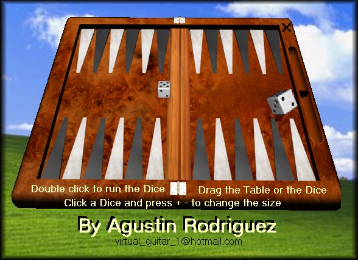

## Real 3D Dice

### Description

This is a bit of my "REAL 3D BACKGAMMON" project that I will publish soon.

I believe that this is the ultimate procedure to make Games that uses Dice.

Requires Windows XP
 
### More Info
 

             |
---                |---
**Submitted On**   |2006-02-17 14:29:08
**By**             |[Agustin Rodriguez](https://github.com/Planet-Source-Code/PSCIndex/blob/master/ByAuthor/agustin-rodriguez.md)
**Level**          |Intermediate
**User Rating**    |5.0 (20 globes from 4 users)
**Compatibility**  |VB 6\.0
**Category**       |[Games](https://github.com/Planet-Source-Code/PSCIndex/blob/master/ByCategory/games__1-38.md)
**World**          |[Visual Basic](https://github.com/Planet-Source-Code/PSCIndex/blob/master/ByWorld/visual-basic.md)
**Archive File**   |[Real\_3D\_Di1974452182006\.zip](https://github.com/Planet-Source-Code/agustin-rodriguez-real-3d-dice__1-64377/archive/master.zip)

